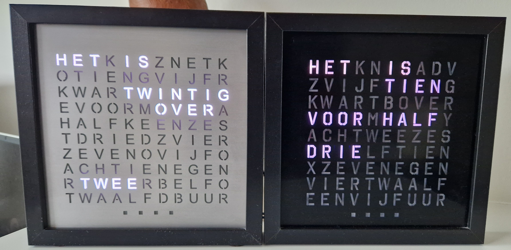

# Woordklok

Word clock originally based on [Bitlair Wordclock](https://github.com/bitlair/wordclock) but rebuilt from scratch.

I've built one black plastic one with only an light sensitive sensor (LDR) and an aluminium one with an LDR and a touch sensitive surface on top, which I plan to use as a button. The clockface is in Dutch but the principle is the same for other languages. The software is setup to be generic (thanks to the way Bitlair wrote the initial version).

The clock needs to be connected to WiFi and gets the time from an NTP-server (configurable).

## Construction

The clock was built following the Bitlair instructions. I've made some additional material but this could still be considered a work in progress. Various documentation can be found in the doc-folder.

### Components:

* Ikea RIBBA Photo Frame 23x23. Unfortunately this frame seems to be out of production. You will need to adapt the hardware design to the frame you use.
* Front plate with lettering.

  * There are a few templates in the[ template](doc/templates/) folder. There are several parts: the clockface itself with the letters, a grid with the positioning of the LEDs and spacers/baffles to keep the LED light from radiating to other letters.
  * If you want to design your own letterplate, I've made an Excel file (clockface_design.xlsx) to check the letters/words with the different needed time-phrases. Not sure this will be helpful to somebody.
  * You have several options to create the letterplate: lasercutting (which I did and I filled the letters with epoxy for a smooth finish), a sticker on a translucent plate and probably other ways as well.
* An arduino chip: I've used a NodeMCU and a ESP32 S3 (Lolin Wemos S3 mini). The last one has my preference because it's small and has touch pins. The software works with ESP8266 and ESP32
* A LED strip that has enough leds for the entire plate (114 in my case). I've used a WS2812B strip. The spacing should match the spacing of the letters in your template.
* A way to power it. I've used a 5V DC socket but you can use other ports. Do not power the LED strip through the arduino board, it should be powered seperately.
* Optional:

  * Light sensitive sensor / LDR for adaptive brightness.
  * You can make the top surface touch sensitive using tin foil with a wire going to a touch pin. If you glue a thin piece of paper (silk paper) in the right color to the tin foil, this makes an 'invisible' button. See the picture in the pictures folder.

### Assembly

The presentation workshopwordclock2019-01.odp gives you a good idea of the different steps. There are photos of the different parts in the doc/pictures-folder.

* Cut the led strip to the right amount of LEDs for each row and wire the together. The wiring starts at the last led and goes up. Best you use a template to glue the led strip to the right position. Attach power and ground and attach the signal wire to the arduino board to the correct pin (RX for NodeMCU and 13 for ESP32)
* Optional: Mount the LDR to the frame and wire it to the arduino board, typically A0 (ESP8266) or A1 (I used this for ESP32) pin.
* I did not wire everything directly to the arduino board to be able to detach the board for programming.

`<photo of fritzing / wiring>`

## Software

The sofware has 2 main parts:

* Arduino backend that drives the clock and exposes some REST endpoints.
* ReactJS frontend stored on the board (in LittleFS) that is used to configure the colormode/colors and brightness mode / brightness.

### Arduino code

The Arduino code was written in VSCode with PlatformIO. The code is in src/ and the JSON-configuration files are in config/. On startup the system expects a 

* clockface.json: some system params and the clockface layout. The layout contains the words, position of the LEDs and the method-name used to check if this word should be on/off (background)
* config.json with the configuration of color, brightness and sensors. This contains the hex representation of the color "#RRGGBB". When "#xxxxxx" is put, this means the complementary color.

These files should be in the data/ folder. 2 examples are stored in the config/ folder, for the 2 layouts I built. I keep them in the config/ folder and these are copied when building the web-interface.

You should be able to build it with PlatformIO. Libraries used are: NeoPixelBus (to drive the LED), ArduinoJson (handling the configuration files), WiFiManager (WiFi access portal for configuration), ElegantOTA (firmware/filesystem update tool) and OneButton (only used for my touch based clock).

On first boot without any WiFi preconfigured, an AP ("Woordklok-AP") will be visible to configure the WiFi. Connect your phone to it and configure the WiFi.

After that it should startup and display the time. You can turn on debug-messages in the code and see some info through the serial-console.

### Web Interface

The web/-folder contains a ReactJS interface. Normally you should be able to use the interface that was built in the data/-folder. The user-interface is in Dutch however.

If you would like to build the code yourself, install React in the web/-folder. The build-system uses webpack, that also copies the config-files to data/ at the end.

There are 2 main built-modes:

* `npm run start:acc `- acceptance mode: run a local version in VSCode that connects to the rest-services of the clock. That way you can adapt the web-code and see how the clock responds. You will need to put the correct address in env.acceptance.
* `npm run build` - production build: build and minify the code and write it to data/ together with the config files. It also creates the filesystem image to write to the board (hardwired to be Wemos S3 target), but you can change that.
